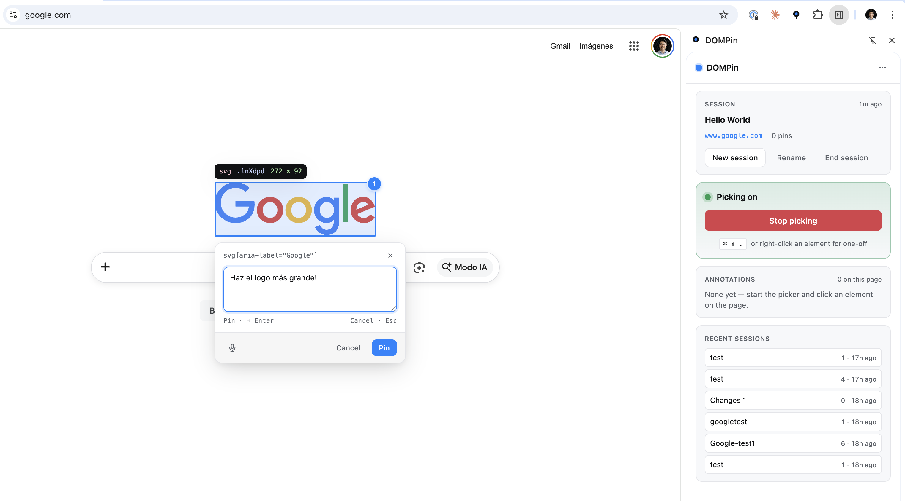

# DOMPin

> Pin elements on any web page. Annotations land in a folder on your machine, ready for any AI coding agent.

<p align="center">
  
</p>

DOMPin is a Chrome extension that lets you click any element or drag a custom region on any web page, drop a comment, and capture the full DOM context — selector, XPath, outerHTML preview, computed styles, viewport and zoomed screenshots, React Fiber info, console state, attachments, and optional audio transcription — straight into a folder you choose. Hand the folder to Claude Code, Cursor, or any tool that reads local files. No server, no port to manage.

## How it works

1. Install the extension. The first time it loads, the side panel walks you through picking a folder.
2. Click the DOMPin icon to open the side panel. Start a named session for the current tab — that becomes a subfolder where this round of annotations will land.
3. Hit **Start picking**, click any element on the page, type a comment, press Enter. To mark a custom area instead of a DOM node, click and drag a rectangle over the region you want. Chain as many pins as you want — the picker stays on until you stop it.
4. Use the microphone button to record audio and insert a provider transcript into the visible note, or use the attachment button to add screenshots and files to the pin before sending.
5. Need a quick one-off without leaving your flow? Hit `⌘⇧.` (Mac) / `Ctrl⇧.` (Win/Linux) for a single-shot pick that auto-stops, or right-click any element and choose **Annotate element with DOMPin** to capture transient UI like dropdowns and popovers without dismissing them.
6. For longer walkthroughs, use **Record session**. DOMPin saves the video first, transcribes the
   narration, and lets you mark exact video frames with `⌘/Ctrl + Shift + click` while recording.
7. For technical investigations, use **Debug capture**. The default mode records external API calls,
   clicks, view changes, and linked screenshots; aggressive same-origin capture and console capture
   are optional settings.
8. Open the vault folder in your editor and let your AI agent work from it.

## File layout

```
<your-vault>/
  example.com/
    20260505-1432__landing_a1f2/
      README.md
      01.md
      01.element.png
      01.viewport.png
      01.json
      01.attachments/
        screenshot.png
      02.md
      02.element.png
      02.viewport.png
      02.json
```

Each `NN.md` contains your comment, optional voice transcript, attachment links, the picked element or region data, and links to the screenshots. `NN.element.png` is a clean crop of the picked element or custom region with padding. `NN.viewport.png` is the full viewport with all annotation markers, the highlight, and the element infobox visible — so the agent can see exactly what you saw. `NN.json` carries the full structured payload for tools that prefer to parse rather than read prose. See [docs/file-schema.md](docs/file-schema.md) for the full specification.

## Sessions

Sessions are explicit and named. The side panel shows the current session for the active tab; **New session** opens an inline name field so you can split work into focused folders. Press Enter without typing anything and DOMPin falls back to a default name like `host_HHMM`. The card lists pin count and last-write time at a glance; **Rename** and **End session** are visible on the session card. End session stops the picker and frees the tab — your files stay where they are.

Recent sessions for the same domain are listed below for quick context. When the current tab is on the same view as a recent session, **Resume** reactivates that session so new annotations continue in the existing folder.

The annotation list shows the full active session, grouped into pins from the current view and pins from other views. Click a row to jump to that annotation on the page; **Edit** reopens the in-page DOMPin popup with the original comment, voice tools, and attachments.

Markers are scoped to the view you captured them on. A session can span several pages or SPA routes; when you move to a different view its pins step aside — both the on-page markers and the side-panel list — and they reappear the moment you return. So pinning the home page and then walking through a menu or sub-section keeps each view's annotations to itself.

## Picker modes

- **Sticky** (default, from the side panel button): stays on across multiple pins until you stop it. Best for a focused review of several elements or regions in a row.
- **One-shot** (`⌘⇧.` / `Ctrl⇧.`): grabs a single element, then auto-stops. Best for an isolated capture without breaking your reading flow.
- **Right-click context menu**: pick **Annotate element with DOMPin** on any element. The comment popup opens for that exact element without dismissing whatever was already on screen — invaluable for hover dropdowns, modals, and popovers that disappear when you click outside them.

Click and drag while the picker is active to draw a dashed rectangular region. Region pins capture the crop and include the visible elements whose centers fall inside the rectangle.

All three require an active session for the tab. If there isn't one, the side panel opens and the Session card flashes so you know where to start.

## Privacy

Annotations and attachments stay in the folder you pick. DOMPin asks for read-write access to that folder — nothing else. There is no telemetry and no DOMPin server. If you enable audio transcription and add an OpenAI or ElevenLabs API key, recorded audio is sent directly from the extension to the selected provider for transcription. Recording runs at the extension's own origin, so the first time you use it DOMPin asks for microphone access once — after that it works on any site without re-prompting, and the audio never touches the page you're annotating. An allowlist controls which sites the picker is available on.

## Install

```bash
git clone https://github.com/YosephFr/dompin.git
cd dompin
pnpm install
pnpm build
```

Then load `packages/extension/dist` as an unpacked extension at `chrome://extensions` (Developer mode → Load unpacked). The first time you click the icon, the side panel's wizard walks you through picking a vault folder. Full instructions in [docs/installation.md](docs/installation.md).

## Why

- Browser-internal annotation tools live in a sandboxed browser, so you lose your real session, extensions, and dev muscle memory. DOMPin runs on your real Chrome.
- DevTools-based pickers are precise but skip the comment workflow.
- Localhost-only annotators do not help when you need to point at your deployed app. DOMPin works on any URL.
- Server-based bridges add a process, a port, and a daemon. DOMPin is just files on disk.

## Documentation

- [Installation](docs/installation.md)
- [Architecture](docs/architecture.md)
- [File schema](docs/file-schema.md)
- [Development](docs/development.md)

## Disclaimer

DOMPin is an independent open-source project. It is not affiliated with, endorsed by, or sponsored by Anthropic, OpenAI, or any other AI tooling vendor. The folder format is the entire integration — any tool that reads local files can use it.

## License

[MIT](LICENSE)
